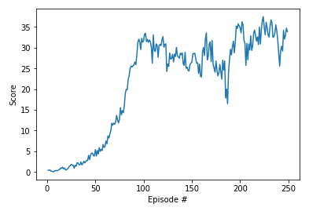

# Report

## Learning Algorithm

Actor-Critic Algorithm - TODO

State Space: 33
Action Space: 4

Actor Architecture (States to Actions):
  1. Linear Layer (33 -> 128, ReLU Activation)
  2. Batch Normalization Layer
  3. Linear Layer (128 -> 128, ReLU Activation)
  4. Linear Layer (128 -> 4, tanh Activation)

Critic Architecture (States & Actions to Reward):
  1. Linear Layer (33 -> 128, ReLU Activation)
  2. Batch Normalization Layer
  3. Linear Layer (128 + 4 -> 128, ReLU Activation)
  4. Linear Layer (128 -> 1)

Hyper-Parameters for the Actor-Critic Algorithm are below:
```python
BUFFER_SIZE = int(1e5)  # replay buffer size
BATCH_SIZE = 128        # minibatch size
GAMMA = 0.99           # discount factor
TAU = 1e-3              # for soft update of target parameters
LR_ACTOR = 1e-4         # learning rate of the actor 
LR_CRITIC = 1e-4        # learning rate of the critic
WEIGHT_DECAY = 0        # L2 weight decay
```

### Actor-Critic Explanation

TODO

## Plot of Rewards



After hitting 249 episodes, the past 100 episodes (averaged over 20 agents) met the +30 score requirement to consider the enviroment solved.

## Ideas for Future Work

TODO
